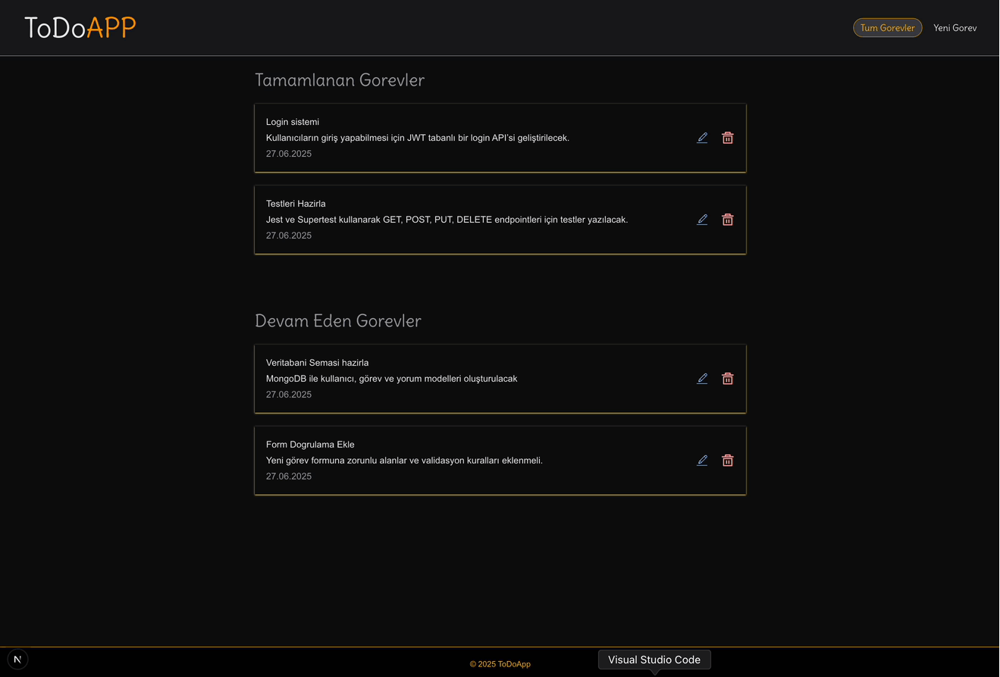

## ToDoAPP(FullStackNext.js)

- Kullanilan Teknolojiler
- - Next.js 15(AppRouter): App Router Sayesinde dosya bazli routing kullanildi. Backend islemleri dogrudan app/api klosorunde gelistirildi.Olusturulan tum routlar Postman ile calistirildi
- - Tailwind CSS: Sayfa stillendirmasi ve responsive olmasi saglandi.
- - Zustand: Minimal ve etkili global state yonetimi yapildi. src/store dizininde verileri cekme, ekleme, guncelleme ve silme fonksiyonlari yonetildi
- - MongoDB: NoSQL tabanli bu veritabani sayesinde olusturulan todo verileri ile veri ekleme,okuma,guncelleme ve silme islemleri yapildi.
- - Prisma: Veritabani ile uygulama arasinda bir kopru gorevi goren ORM aracidir. MongoDb uzerinde kolay ve guvenilir modelleme yapildi.Bu model prisma/schema.prisma dosyasinda tanimlandi.CRUD islemlerinde daha sade okunabilir ve hatasiz bir sekilde yapildi.

